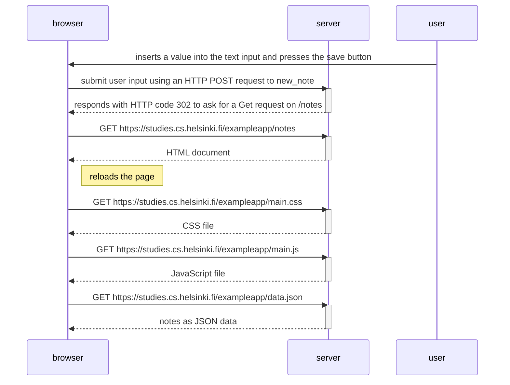

```mermaid
sequenceDiagram
    participant browser
    participant server
    participant user

    user->>browser: inserts a value into the text input and presses the save button
    browser->>server: submit user input using an HTTP POST request to new_note
    activate server
    server-->>browser: responds with HTTP code 302 to ask for a Get request on /notes
    deactivate server
    browser->>server: GET https://studies.cs.helsinki.fi/exampleapp/notes
    activate server
    server-->>browser: HTML document
    deactivate server
    note right of browser: reloads the page
    browser->>server: GET https://studies.cs.helsinki.fi/exampleapp/main.css
    activate server
    server-->>browser: CSS file
    deactivate server
    browser->>server: GET https://studies.cs.helsinki.fi/exampleapp/main.js
    activate server
    server-->>browser: JavaScript file
    deactivate server
    browser->>server: GET https://studies.cs.helsinki.fi/exampleapp/data.json
    activate server
    server-->>browser: notes as JSON data
    deactivate server

```
